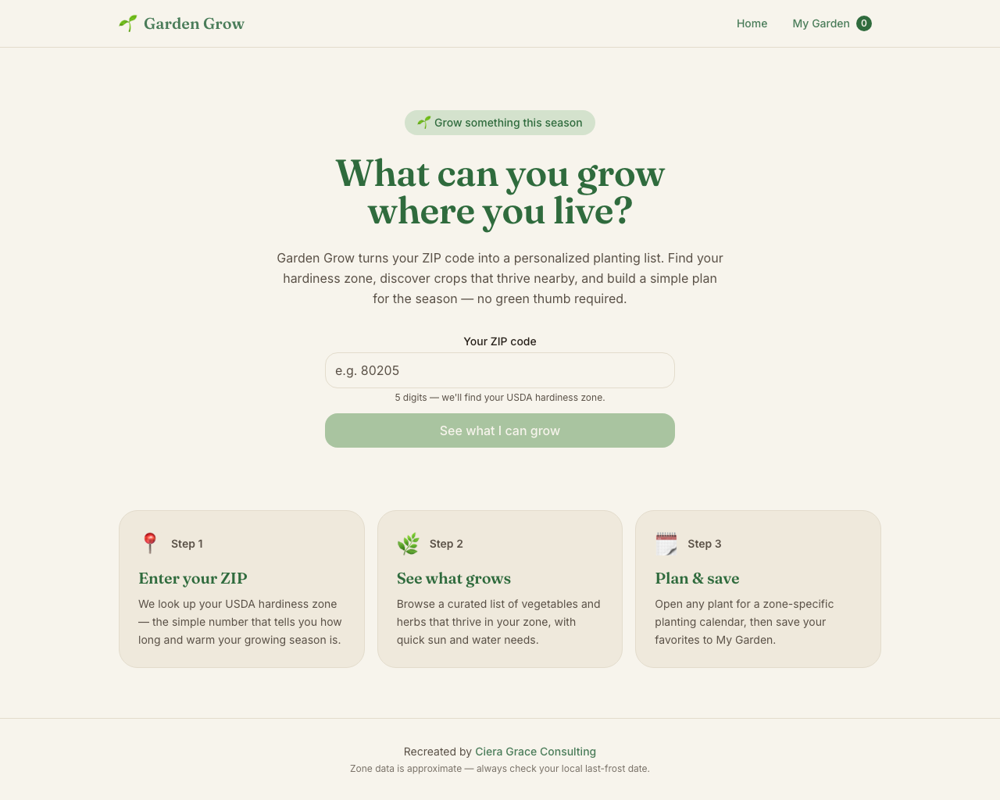
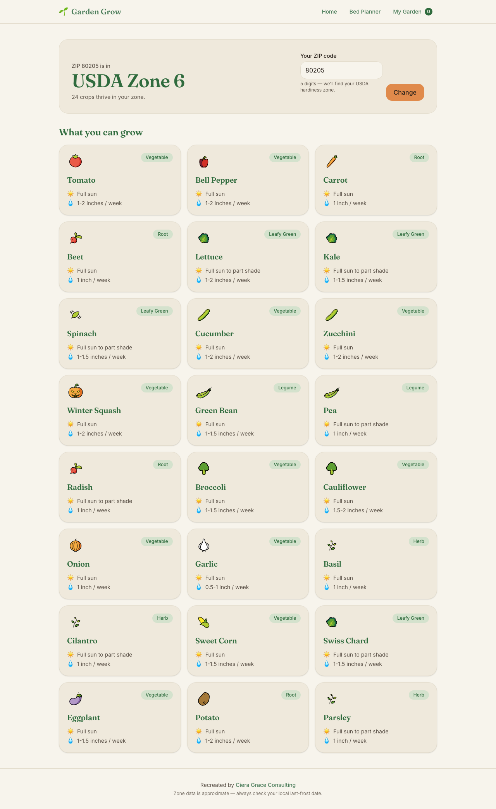
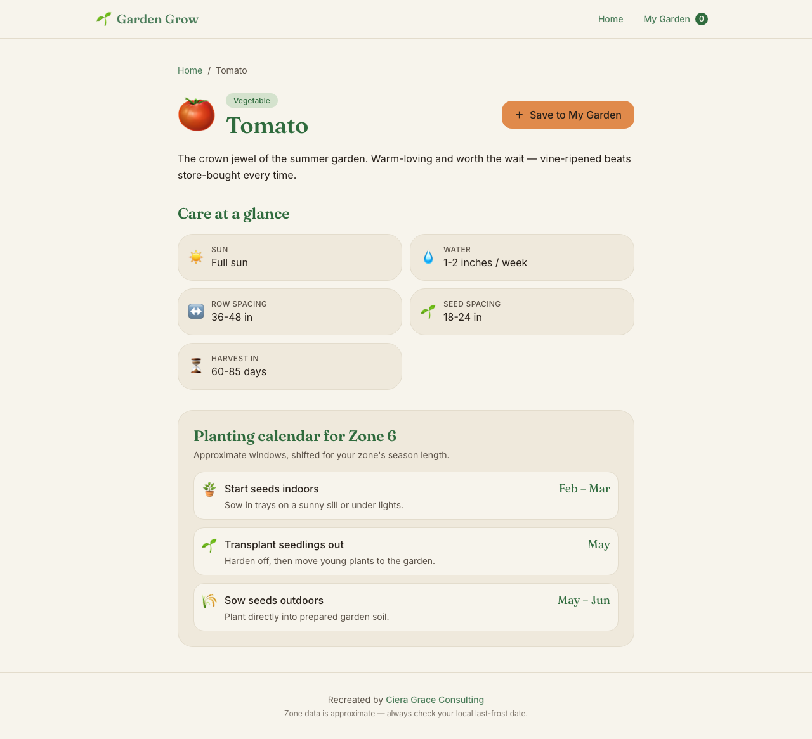
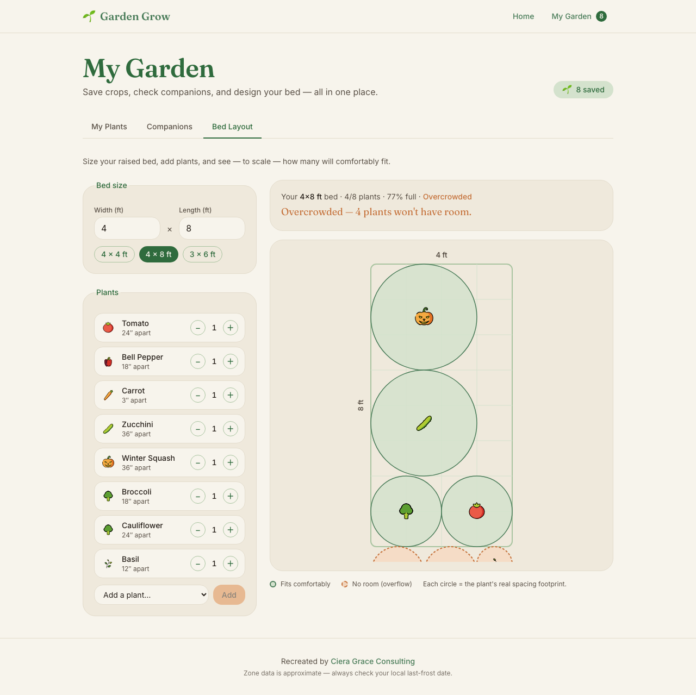
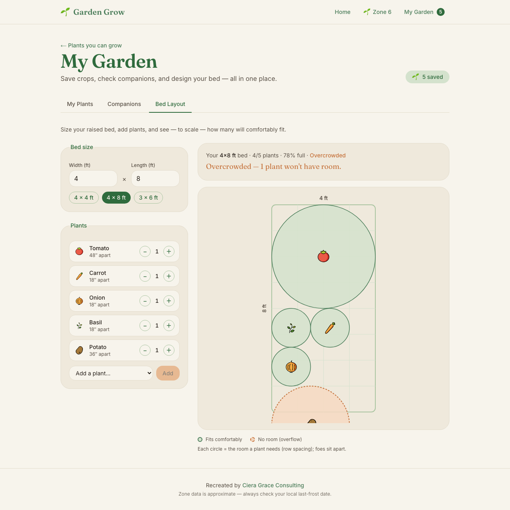
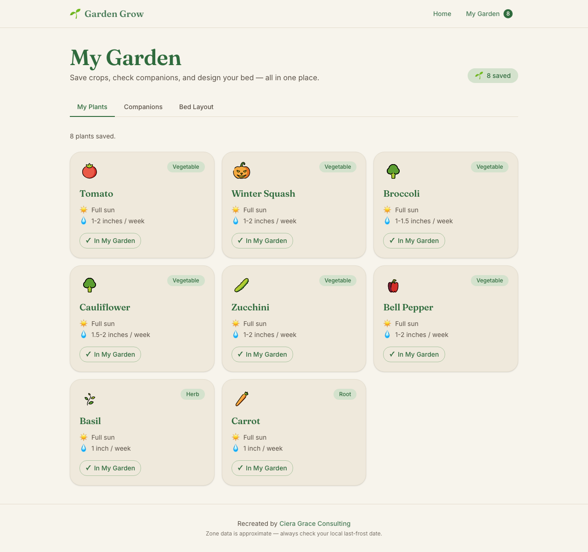
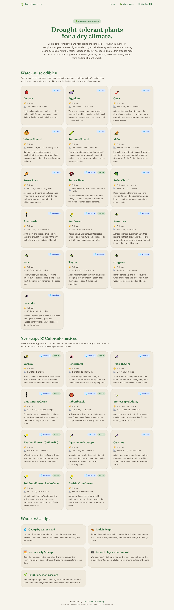

# 🌱 Garden Grow

**Live at [garden-grow-sable.vercel.app](https://garden-grow-sable.vercel.app)**

A planting companion that turns your ZIP code into a USDA growing zone and tells you what to plant — with zone-shifted planting calendars, companion-planting guidance, and a to-scale garden bed designer.

> **Origin:** Garden Grow started as a group capstone project at [Turing School](https://turing.edu). This is a solo rebuild in Next.js, re-architected from the ground up with new features: companion planting, the to-scale Bed Designer, a water-wise plant collection, and more.



## What it does

| | |
|---|---|
| **ZIP → zone → plants** | Enter a ZIP code and get your USDA hardiness zone plus every crop in the 35-plant dataset that thrives there. Zone resolution is fallback-first: a bundled zip3 lookup answers instantly (fully offline-capable), then the live [phzmapi.org](https://phzmapi.org) API refines it. |
| **Zone-shifted calendars** | Each plant's indoor-start / transplant / direct-sow windows shift by zone — earlier in warm zones, later in cold ones, wrapping the calendar year. Fall-planted crops (garlic) shift the opposite direction, the way real gardening works. |
| **Companion planting** | Friends and foes for every plant, kept symmetric across the dataset, with links that preserve your zone context. |
| **Bed Designer** | A to-scale, deterministic packing engine lays your saved plants into a bed as spacing-accurate circles — foes are separated to opposite ends, small plants backfill gaps beside big ones, and you get a roomy/snug/cramped verdict. |
| **Water-wise collection** | Drought-tough edibles (tepary bean, okra, amaranth, Mediterranean herbs…) flagged for low-water gardens. |

| Results by zone | Plant detail | Bed Designer |
|---|---|---|
|  |  |  |

| Foe separation | My Garden | Water-wise |
|---|---|---|
|  |  |  |

## How it's built

- **Next.js (App Router) + TypeScript + Tailwind v4** — no backend, no database. Results pages are server-rendered for SEO; all 35 plant pages prerender as static HTML; sitemap, robots, OG cards, and JSON-LD included.
- **Pure, framework-free domain logic** — the bed layout engine (`src/lib/bedLayout.ts`) is deterministic geometry with zero React/DOM dependencies: shelf packing, bipartite foe-graph 2-coloring, and gap backfill. Same inputs, same layout, every time.
- **Tiny external-store state** — saved plants and the remembered zone live in `localStorage` behind `useSyncExternalStore` stores with cross-tab sync; no state library.
- **Curated dataset, no AI-at-runtime** — 35 plants with spacing, depth, duration, zones, and symmetric companion relationships, all typed and invariant-checked.
- **OpenMoji illustrations** — plant icons render as illustrated SVGs with graceful emoji fallback, split so the server-rendered cards stay out of the client bundle.

## Run it locally

```bash
npm install
npm run dev
```

Open [http://localhost:3000](http://localhost:3000) and enter a ZIP (try Denver — `80205`).

## Author

Built by **Ciera Muniz** — [cieragrace.com](https://www.cieragrace.com) · [GitHub](https://github.com/cieragrace)
